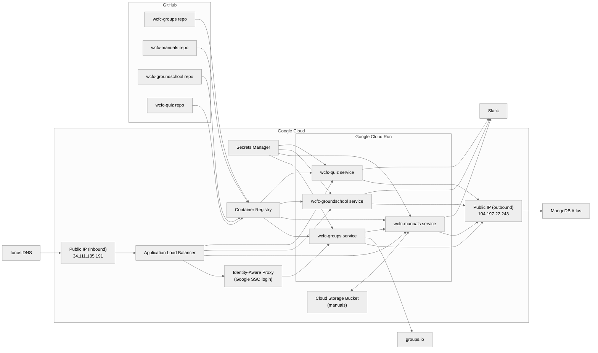

## WCFC-Apps

### Overview

This GitHub org holds the source code for several apps used by the
Wings of Carolina Flying Club.  The apps are:

* `wcfc-manuals`: Stores the Pilot's Operating Handbooks and other manuals for WCFC airplanes. Allows access by registered members.
* `wcfc-quiz`: Manages a question bank and generates quizzes for initial and recurrent training of WCFC pilots.
* `wcfc-groundschool`: Provides educational materials to enrolled ground school students.
* `wcfc-groups`: Administrative tool used to sync membership between MyFBO, groups.io and the wcfc-manuals app.

The following apps also exist, but are no longer used (or were never used):

* `wcfc-learning`: Learning management system with presentations, events, etc.
* `wcfc-students`: Flight training management system
* `wcfc-squawk`: Aircraft defect management system

Additionally, the following repos store code used internally or for utility purposes:

* `wcfc-backup`: Container image used to perform regular backups of the MongoDB data
* `wcfc-updater`: Container image used for a Google Run Job to redeploy apps after Dependabot updates
* `wcfc-integration-testing`: Container image with Playwright and WireMock, used for running integration tests

### Deployment

These apps are deployed to Google Cloud, under consolidated billing with the club's Google Workspace account.
The applications use a MongoDB database, which is hosted on a MongoDB Atlas Flex instance billed through Google
Cloud Marketplace.  MongoDB admin access is via SSO to Google Workplace.  DNS is hosted on Ionos along with the Club's
main website.

### Diagram

